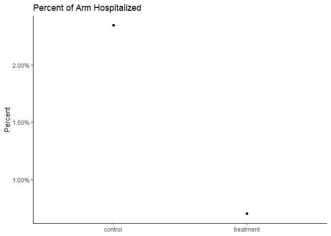
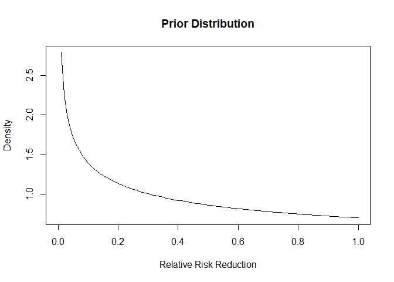
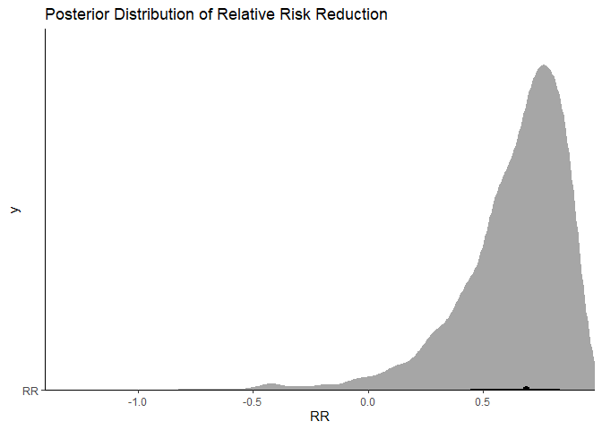
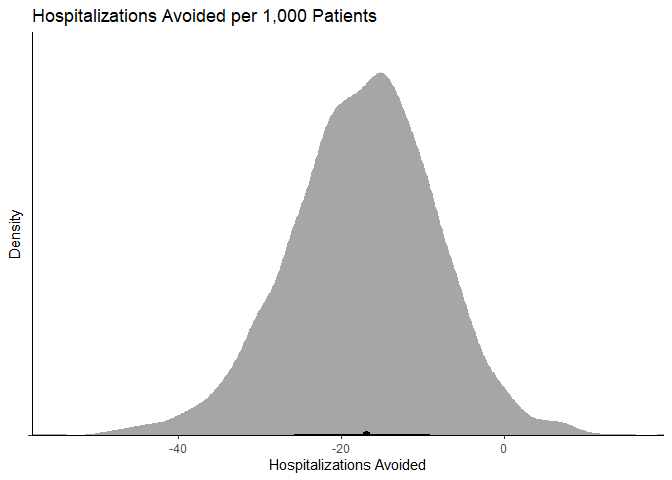

Can Bayesian Analysis Save Paxlovid?
================

# Paxlovid

Paxlovid is a new antiviral (protease inhibitor) that when paired with
ritonavir provides excellent protection against hospitalization for
those patients infected with SARS-CoV-2. Pfizer, the manufacturer, had
two endpoints. The first endpoint was for “High Risk” patients and a
secondary endpoint for “Standard Risk” patients. I thought it was neat
that BioNTech/Pfizer used a Bayesian analysis for their BNT162b2 vaccine
and was a little surprised when I saw a frequentist p-value for their
second endpoint:

From their [press
release](https://www.pfizer.com/news/press-release/press-release-detail/pfizer-announces-additional-phase-23-study-results).

> A follow-on analysis at 80% of enrolled patients was consistent with
> these findings. In this analysis, 0.7% of those who received PAXLOVID
> were hospitalized following randomization (3/428 hospitalized with no
> deaths), compared to 2.4% of patients who received placebo and were
> hospitalized or died (10/426 hospitalized with no deaths); p=0.051.

Oh no, p \< 0.05, let’s throw away the drug for standard patients. This
seems like a perfect time to do a Bayesian analysis and see what our
uncertainty could be regarding the effect in this seemingly underpowered
arm of the trial (e.g., we would have liked to have seem more people in
this cohort because the smallest reasonable effect we would like would
be say a 20% reduction in relative risk or even less as our hospitals
fill with patients).

## Reanalysis

First we need to recreate the data:

``` r
library(cmdstanr)
```

    ## This is cmdstanr version 0.4.0.9000

    ## - CmdStanR documentation and vignettes: mc-stan.org/cmdstanr

    ## - CmdStan path: C:/Users/54011/.cmdstanr/cmdstan-2.28.1

    ## - CmdStan version: 2.28.1

    ## 
    ## A newer version of CmdStan is available. See ?install_cmdstan() to install it.
    ## To disable this check set option or environment variable CMDSTANR_NO_VER_CHECK=TRUE.

``` r
library(tidybayes)
library(posterior)
```

    ## This is posterior version 1.1.0

    ## 
    ## Attaching package: 'posterior'

    ## The following objects are masked from 'package:stats':
    ## 
    ##     mad, sd, var

``` r
library(ggplot2)
library(dplyr)
```

    ## 
    ## Attaching package: 'dplyr'

    ## The following objects are masked from 'package:stats':
    ## 
    ##     filter, lag

    ## The following objects are masked from 'package:base':
    ## 
    ##     intersect, setdiff, setequal, union

``` r
library(ggdist)

dat_trials <- tibble::tribble(
  ~"hospitalized", ~"arm_n", ~"arm",
  3, 428, "treatment",
  10, 426, "control"

) %>%
  mutate(prop = hospitalized/arm_n)


dat_trials %>%
  ggplot(aes(arm, prop))+
  geom_point()+
  scale_y_continuous(labels = scales::percent)+
  labs(
    title = "Percent of Arm Hospitalized",
    y = "Percent",
    x = NULL
  )+
  theme_classic()
```

<!-- -->

Seems like there is an effect! We can also reproduce the frequentist
analysis:

``` r
prop.test(x = c(3,10), n = c(428,426),
          alternative = "less", correct = TRUE)
```

    ## 
    ##  2-sample test for equality of proportions with continuity correction
    ## 
    ## data:  c(3, 10) out of c(428, 426)
    ## X-squared = 2.8407, df = 1, p-value = 0.04595
    ## alternative hypothesis: less
    ## 95 percent confidence interval:
    ##  -1.000000000 -0.000353954
    ## sample estimates:
    ##      prop 1      prop 2 
    ## 0.007009346 0.023474178

Ok, so p \< 0.05 in this is weird. Maybe they did some multiple testing
adjustment? Moving on….

### Enter Stan

I am going to use the following Stan code that was posted [on this
blog](https://www.robertkubinec.com/post/vaccinepval/) which in turn
originated from [this blog](https://rpubs.com/ericnovik/692460).

Nothing too crazy, it this code, it just fits our observed data to
binomial distributions and we can look at the relative effect and the
absolute effect

``` r
writeLines(readLines("trial.stan"))
```

    //based on https://www.robertkubinec.com/post/vaccinepval/
    // Which is based on https://rpubs.com/ericnovik/692460
    data {
      int<lower=1> r_c; // num events, control
      int<lower=1> r_t; // num events, treatment
      int<lower=1> n_c; // num cases, control
      int<lower=1> n_t; // num cases, treatment
      real a[2];   // prior values for treatment effect

    }
    parameters {
      real<lower=0, upper=1> p_c; // binomial p for control
      real<lower=0, upper=1> p_t; // binomial p for treatment
    }
    transformed parameters {
      real RR  = 1 - p_t / p_c;  // Relative effectiveness
    }
    model {
      (RR - 1)/(RR - 2) ~ beta(a[1], a[2]); // prior for treatment effect
      r_c ~ binomial(n_c, p_c); // likelihood for control
      r_t ~ binomial(n_t, p_t); // likelihood for treatment
    }
    generated quantities {
      real effect   = p_t - p_c;      // treatment effect
      real log_odds = log(p_t / (1 - p_t)) - log(p_c / (1 - p_c));
    }

Additionally, we need to supply a prior. I am going to use exactly the
same priors that Pfizer/BioNTech for their vaccine as a starting point:

``` r
curve(dbeta(x, shape1 = .700102, shape2 = 1), 
      from = 0, to = 1, 
      ylab = "Density", xlab = "Relative Risk Reduction",
      main = "Prior Distribution")
```

<!-- -->

This distribution places more density on the drug not having an effect,
so we are being a bit pessimistic.

### Run the Code

``` r
mod <- cmdstan_model("trial.stan")

dat <- list(
  n=sum(dat_trials$arm_n),
       r_c=dat_trials[2,]$hospitalized,
       r_t=dat_trials[1,]$hospitalized,
       n_c=dat_trials[2,]$arm_n,
       n_t=dat_trials[1,]$arm_n,
       a=c(.700102,1)
)
fit <- mod$sample(dat, refresh = 0)
```

    ## Running MCMC with 4 chains, at most 12 in parallel...

    ## Chain 1 Informational Message: The current Metropolis proposal is about to be rejected because of the following issue:

    ## Chain 1 Exception: beta_lpdf: Random variable is nan, but must be in the interval [0, 1] (in 'C:/Users/54011/AppData/Local/Temp/Rtmpua6ot5/model-771c369e7e11.stan', line 19, column 2 to column 39)

    ## Chain 1 If this warning occurs sporadically, such as for highly constrained variable types like covariance matrices, then the sampler is fine,

    ## Chain 1 but if this warning occurs often then your model may be either severely ill-conditioned or misspecified.

    ## Chain 1

    ## Chain 2 Informational Message: The current Metropolis proposal is about to be rejected because of the following issue:

    ## Chain 2 Exception: beta_lpdf: Random variable is nan, but must be in the interval [0, 1] (in 'C:/Users/54011/AppData/Local/Temp/Rtmpua6ot5/model-771c369e7e11.stan', line 19, column 2 to column 39)

    ## Chain 2 If this warning occurs sporadically, such as for highly constrained variable types like covariance matrices, then the sampler is fine,

    ## Chain 2 but if this warning occurs often then your model may be either severely ill-conditioned or misspecified.

    ## Chain 2

    ## Chain 3 Informational Message: The current Metropolis proposal is about to be rejected because of the following issue:

    ## Chain 3 Exception: beta_lpdf: Random variable is nan, but must be in the interval [0, 1] (in 'C:/Users/54011/AppData/Local/Temp/Rtmpua6ot5/model-771c369e7e11.stan', line 19, column 2 to column 39)

    ## Chain 3 If this warning occurs sporadically, such as for highly constrained variable types like covariance matrices, then the sampler is fine,

    ## Chain 3 but if this warning occurs often then your model may be either severely ill-conditioned or misspecified.

    ## Chain 3

    ## Chain 4 Informational Message: The current Metropolis proposal is about to be rejected because of the following issue:

    ## Chain 4 Exception: beta_lpdf: Random variable is nan, but must be in the interval [0, 1] (in 'C:/Users/54011/AppData/Local/Temp/Rtmpua6ot5/model-771c369e7e11.stan', line 19, column 2 to column 39)

    ## Chain 4 If this warning occurs sporadically, such as for highly constrained variable types like covariance matrices, then the sampler is fine,

    ## Chain 4 but if this warning occurs often then your model may be either severely ill-conditioned or misspecified.

    ## Chain 4

    ## Chain 1 finished in 0.1 seconds.
    ## Chain 2 finished in 0.1 seconds.
    ## Chain 3 finished in 0.1 seconds.
    ## Chain 4 finished in 0.1 seconds.
    ## 
    ## All 4 chains finished successfully.
    ## Mean chain execution time: 0.1 seconds.
    ## Total execution time: 0.4 seconds.

    ## Warning in seq.default(from = 1, len = along - 1): partial argument match of
    ## 'len' to 'length.out'

    ## Warning in seq.default(to = N - 1, len = N - along): partial argument match of
    ## 'len' to 'length.out'

    ## Warning in seq.default(len = N): partial argument match of 'len' to 'length.out'

    ## Warning in seq.default(along = arg.names): partial argument match of 'along' to
    ## 'along.with'

    ## Warning in seq.default(len = length(arg.list)): partial argument match of 'len'
    ## to 'length.out'

    ## Warning in seq.default(along = perm): partial argument match of 'along' to
    ## 'along.with'

    ## Warning in seq.default(along = perm): partial argument match of 'along' to
    ## 'along.with'

    ## Warning in seq.default(along = perm): partial argument match of 'along' to
    ## 'along.with'

    ## Warning in seq.default(along = perm): partial argument match of 'along' to
    ## 'along.with'

    ## Warning in seq.default(along = perm): partial argument match of 'along' to
    ## 'along.with'

    ## Warning in seq.default(along = perm): partial argument match of 'along' to
    ## 'along.with'

    ## Warning in seq.default(along = perm): partial argument match of 'along' to
    ## 'along.with'

    ## Warning in seq.default(along = perm): partial argument match of 'along' to
    ## 'along.with'

    ## Warning in seq.default(len = ncol(arg.dim)): partial argument match of 'len' to
    ## 'length.out'

    ## Warning in seq.default(len = N): partial argument match of 'len' to 'length.out'

    ## Warning in seq.default(along = arg.names): partial argument match of 'along' to
    ## 'along.with'

    ## Warning in seq.default(along = arg.names): partial argument match of 'along' to
    ## 'along.with'

    ## Warning in seq.default(len = length(arg.names)): partial argument match of 'len'
    ## to 'length.out'

    ## Warning in seq.default(along = perm): partial argument match of 'along' to
    ## 'along.with'

### Analyzing the Results

First we can look at our summaries (note that I did look at the chains
for mixing and we have adequate samples in the tails).

``` r
fit$summary() %>% 
  select(variable, median, mean, q5,q95, rhat) %>% 
  knitr::kable(digits = 2)
```

    ## Warning in seq.default(from = 1, len = along - 1): partial argument match of
    ## 'len' to 'length.out'

    ## Warning in seq.default(to = N - 1, len = N - along): partial argument match of
    ## 'len' to 'length.out'

    ## Warning in seq.default(len = N): partial argument match of 'len' to 'length.out'

    ## Warning in seq.default(along = arg.names): partial argument match of 'along' to
    ## 'along.with'

    ## Warning in seq.default(len = length(arg.list)): partial argument match of 'len'
    ## to 'length.out'

    ## Warning in seq.default(along = perm): partial argument match of 'along' to
    ## 'along.with'

    ## Warning in seq.default(along = perm): partial argument match of 'along' to
    ## 'along.with'

    ## Warning in seq.default(along = perm): partial argument match of 'along' to
    ## 'along.with'

    ## Warning in seq.default(along = perm): partial argument match of 'along' to
    ## 'along.with'

    ## Warning in seq.default(along = perm): partial argument match of 'along' to
    ## 'along.with'

    ## Warning in seq.default(along = perm): partial argument match of 'along' to
    ## 'along.with'

    ## Warning in seq.default(along = perm): partial argument match of 'along' to
    ## 'along.with'

    ## Warning in seq.default(along = perm): partial argument match of 'along' to
    ## 'along.with'

    ## Warning in seq.default(len = ncol(arg.dim)): partial argument match of 'len' to
    ## 'length.out'

    ## Warning in seq.default(len = N): partial argument match of 'len' to 'length.out'

    ## Warning in seq.default(along = arg.names): partial argument match of 'along' to
    ## 'along.with'

    ## Warning in seq.default(along = arg.names): partial argument match of 'along' to
    ## 'along.with'

    ## Warning in seq.default(len = length(arg.names)): partial argument match of 'len'
    ## to 'length.out'

    ## Warning in seq.default(along = perm): partial argument match of 'along' to
    ## 'along.with'

| variable | median |   mean |     q5 |    q95 | rhat |
|:---------|-------:|-------:|-------:|-------:|-----:|
| lp\_\_   | -74.14 | -74.45 | -76.57 | -73.48 |    1 |
| p_c      |   0.03 |   0.03 |   0.02 |   0.04 |    1 |
| p_t      |   0.01 |   0.01 |   0.00 |   0.02 |    1 |
| RR       |   0.69 |   0.63 |   0.19 |   0.90 |    1 |
| effect   |  -0.02 |  -0.02 |  -0.03 |   0.00 |    1 |
| log_odds |  -1.18 |  -1.21 |  -2.32 |  -0.21 |    1 |

So it seems like there is evidence of an effect (a relative risk
reduction of 20-89%)!

``` r
draws <- fit$draws() %>% as_draws_df()


draws %>%
  #median_qi(VE, .width = c(.5, .89, .995)) %>%
  ggplot(aes(y = "RR", x = RR)) +
  stat_halfeye()+
  scale_color_brewer()+
  theme_classic()+
  coord_cartesian(expand = FALSE)+
  labs(
    title = "Posterior Distribution of Relative Risk Reduction"
  )
```

<!-- -->

Ok, so looks again like the bulk of the posterior distribution is a
positive effect. If I said I were only interested in a drug that had a
30% relative risk reduction, I could do the following:

``` r
mean(as.numeric(draws$RR>.3))
```

    ## [1] 0.9125

Ok so 0.91 isn’t bad! In the middle of a pandemic with patients
appearing (with standard risk factors) and an oral treatment option, I
would take that probability. I could also look at what the absolute
effect would mean on hospitalizations:

``` r
draws %>%
  ggplot(aes(y = "", x = effect*1000)) +
  stat_halfeye()+
  scale_color_brewer()+
  theme_classic()+
  coord_cartesian(expand = FALSE)+
  labs(
    title = "Hospitalizations Avoided per 1,000 Patients",
    y = "Density",
    x = "Hospitalizations Avoided"
  )
```

<!-- -->

If I could prevent 0-40 hospitalizations with a cheap-ish treatment, I
would take it. A reminder that if I admit 20 patients and they each stay
4-5 days, I have tied up a ton of “bed days.”

## Summary

The important point here is the Bayesian analysis provides a way to do
these kinds of analysis and not throw away data when endpoints are not
met. In this case the “standard risk” patients would likely profit from
the drug.
